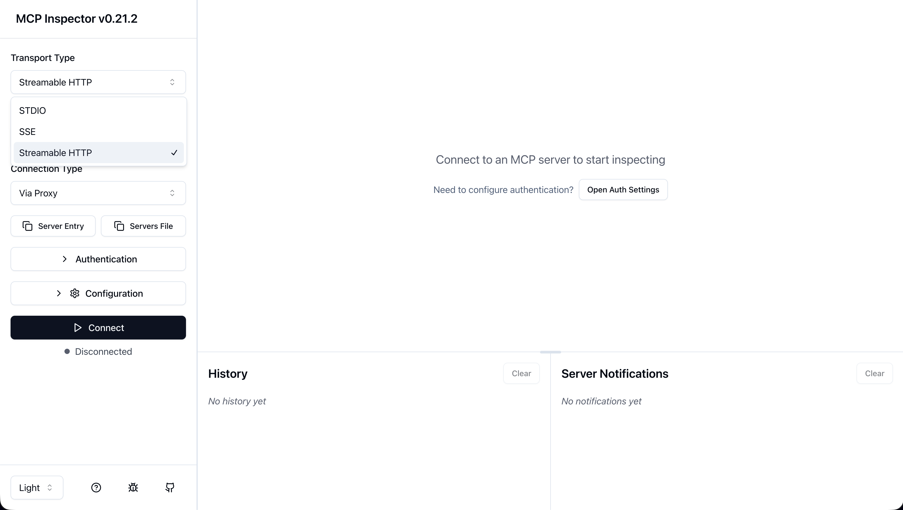
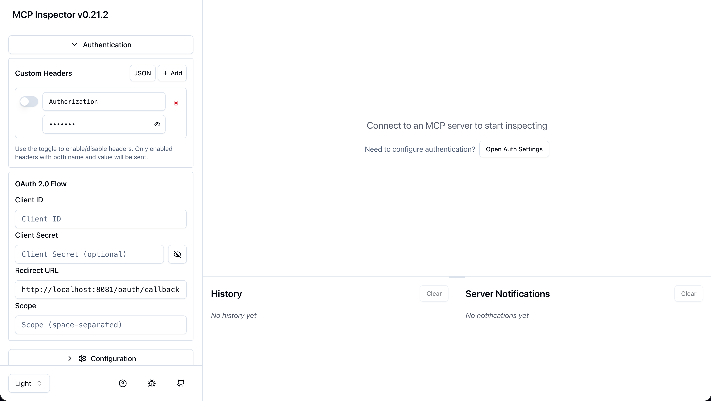
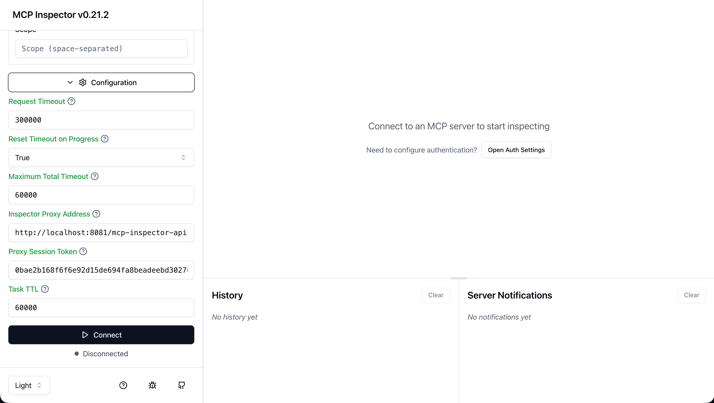
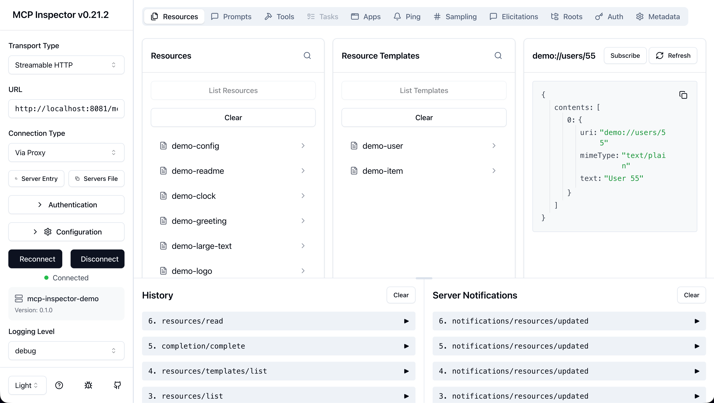
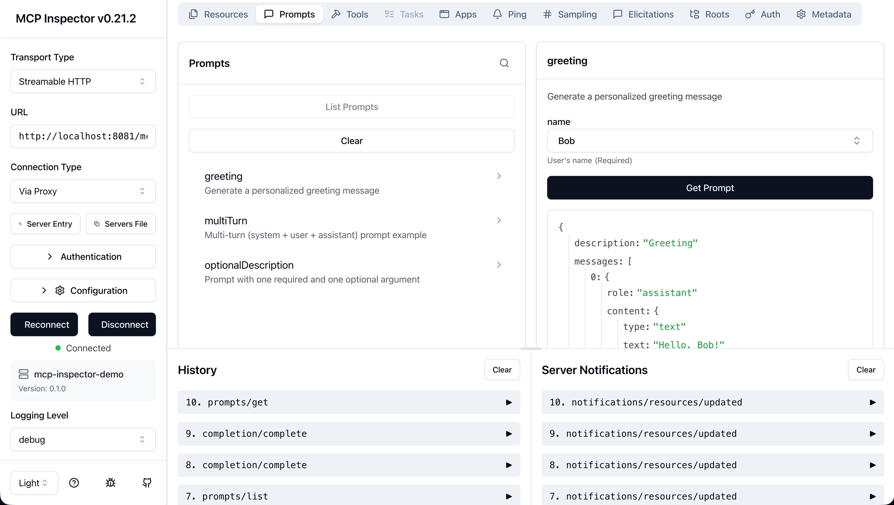
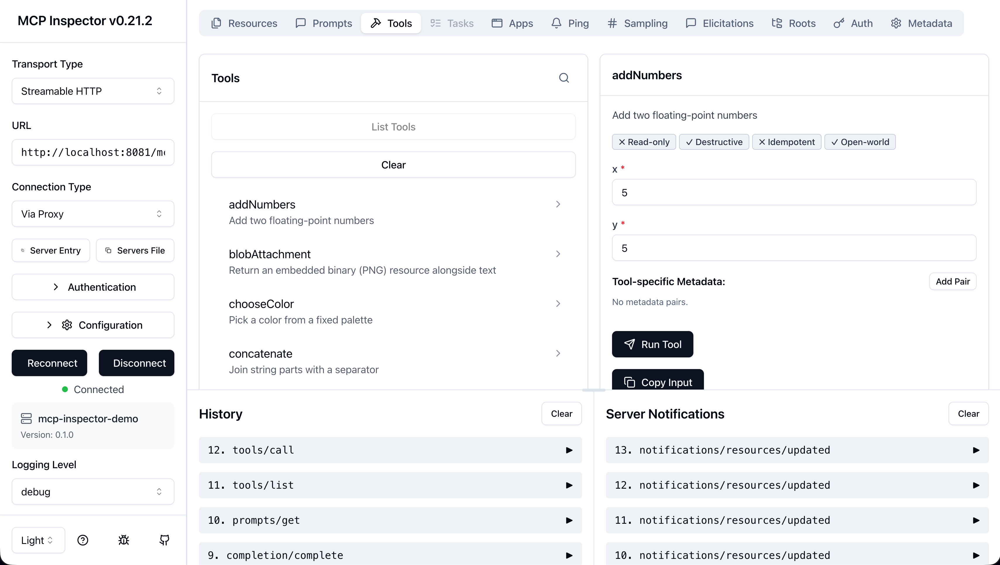
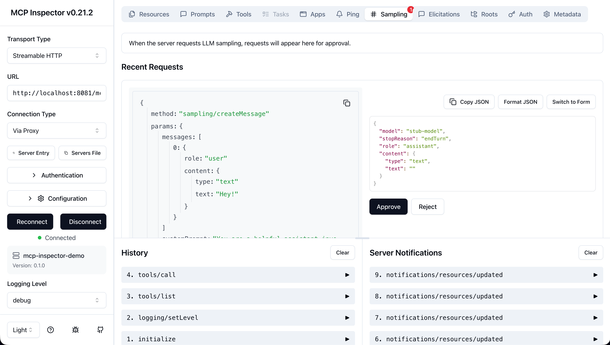
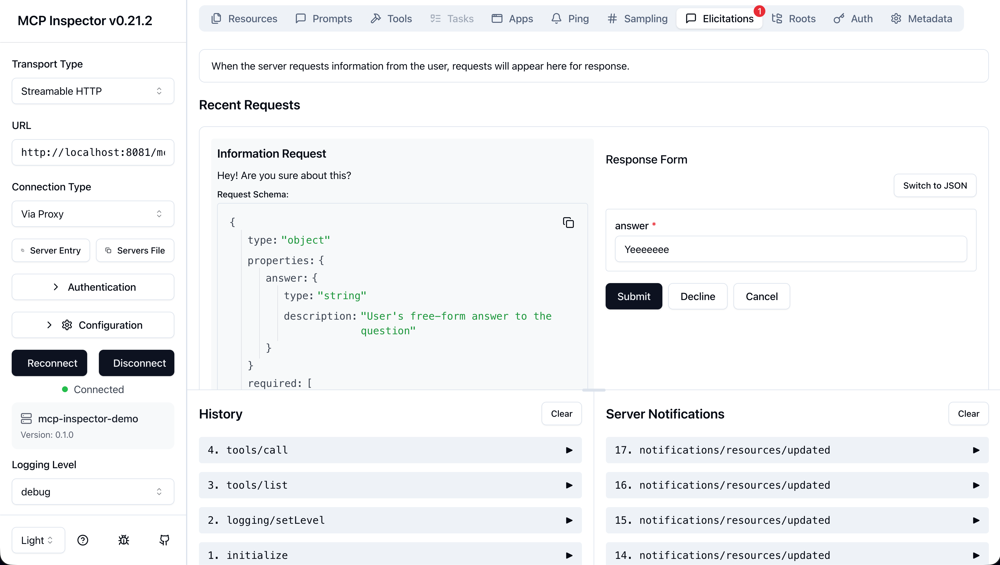
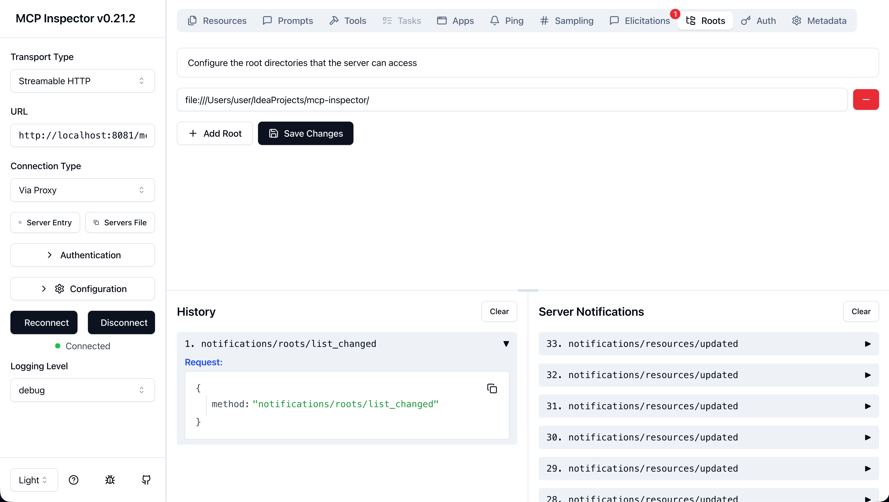
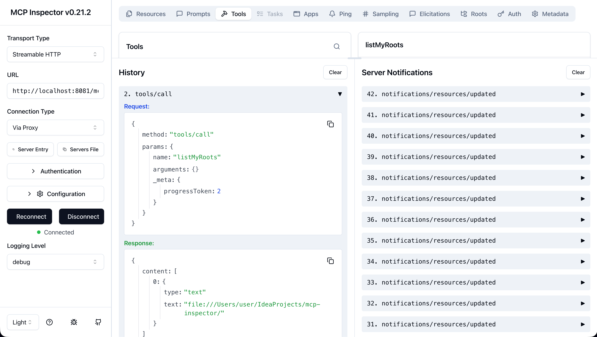

<p align="center">
  
</p>

<h1 align="center">Spring AI MCP Inspector</h1>

<p align="center">
  Embeddable MCP Inspector UI for Spring AI MCP servers — one dependency, zero config.
</p>

<p align="center">
  <a href="LICENSE"></a>
  <a href="https://adoptium.net"></a>
  <a href="https://spring.io/projects/spring-boot"></a>
  <a href="https://modelcontextprotocol.io"></a>
  <a href="CONTRIBUTING.md#code-coverage--mandatory--80"></a>
</p>

Embeddable inspector UI for Spring AI MCP servers. Drop in a single Maven dependency and your application exposes a browser-based MCP inspector at `/mcp-inspector`, wired loopback to the MCP server running in the same Spring Boot process.

Supports all MCP transports (`stdio`, `sse`, `streamable-http`, `stateless-http`) and both servlet (WebMVC) and reactive (WebFlux) stacks. The design follows the same pattern as `springdoc-openapi-starter-webmvc-ui`, zero-config when defaults work, fully overridable when they don't.

## Why

Spring AI's MCP server starters give you a running MCP endpoint, but no UI to talk to it. The reference [MCP Inspector](https://github.com/modelcontextprotocol/inspector) is a standalone Node app that you point at a remote server. This library embeds that same React UI directly into your Spring Boot app, so:

- one process, one port, no separate proxy to deploy
- the inspector connects loopback, so it works in air-gapped/dev environments
- the bootstrap payload (proxy URL, auth token, default server, headers) is pre-filled from your Spring configuration, no copy-paste of secrets into the UI

## Requirements

- Java 17+
- Spring Boot 3.4+
- Spring AI 1.1+ (`org.springframework.ai:spring-ai-bom`)

## Quickstart

### WebMVC

Add the starter alongside your existing `spring-ai-starter-mcp-server-webmvc` dependency:

```xml
<dependency>
    <groupId>io.github.inspector.mcp</groupId>
    <artifactId>spring-ai-mcp-inspector-starter-webmvc</artifactId>
    <version>0.1.0-SNAPSHOT</version>
</dependency>
```

### WebFlux

```xml
<dependency>
    <groupId>io.github.inspector.mcp</groupId>
    <artifactId>spring-ai-mcp-inspector-starter-webflux</artifactId>
    <version>0.1.0-SNAPSHOT</version>
</dependency>
```

Start your application and open `http://localhost:8080/mcp-inspector/`. The inspector is pre-connected to your local MCP server, click **Connect** and you'll see tools/resources/prompts immediately.

## Ported 95% of original MCP Inspector

#### Transport


#### Authorization and custom headers


#### Connection configurations


#### Resources


#### Prompts


#### Tools (basic)


#### Tools (sampling - call to LLM)


#### Tools (elicitation - call to User)


#### Roots


#### Tool cals and events logs


## Configuration properties

All settings live under the `spring.ai.mcp.inspector` namespace:

| Property | Default | Description |
|----------|---------|-------------|
| `spring.ai.mcp.inspector.enabled` | `true` | Toggle the inspector entirely. |
| `spring.ai.mcp.inspector.path` | `/mcp-inspector` | Base path the UI is served at. Must start with `/`, no trailing `/`. |
| `spring.ai.mcp.inspector.auth-enabled` | `true` | When `true`, requests to the proxy endpoint require the bearer token below. |
| `spring.ai.mcp.inspector.auth-token` | _(generated)_ | Bearer token. If unset, a random token is generated at boot and injected into the SPA bootstrap automatically. |

Custom path example:

```yaml
spring:
  ai:
    mcp:
      inspector:
        path: /admin/inspector
```

Inspector now lives at `/admin/inspector/`; the proxy is at `/admin/inspector-api`.

### Proxy timeouts

The proxy backend ships with upstream-compatible defaults. Override them under
`spring.ai.mcp.inspector.timeouts` when an MCP server is unusually slow (or to fail
fast). All values use Spring's relaxed `Duration` syntax — e.g. `30s`, `2m`, `500ms`.

| Property | Default | Description |
|----------|---------|-------------|
| `spring.ai.mcp.inspector.timeouts.sse-session` | `30m` | Inactivity budget for a proxied SSE / streamable-HTTP browser session (servlet stack only). |
| `spring.ai.mcp.inspector.timeouts.streamable-request` | `30s` | Per-request wait for a streamable-HTTP JSON-RPC response before returning `504`. |
| `spring.ai.mcp.inspector.timeouts.fetch-connect` | `10s` | Connect timeout for the outbound `/fetch` HTTP client. |
| `spring.ai.mcp.inspector.timeouts.fetch-request` | `30s` | Per-request timeout for outbound `/fetch` calls. |
| `spring.ai.mcp.inspector.timeouts.server-request` | `120s` | How long a server→UI request (sampling / elicitation / roots) waits for the browser to answer. |

```yaml
spring:
  ai:
    mcp:
      inspector:
        timeouts:
          streamable-request: 60s
          server-request: 5m
```

## Customizing the inspector bootstrap

When the inspector serves `index.html` it injects a single inline
`<script>window.__MCP_INSPECTOR_BOOTSTRAP = { ... }</script>` block that the
upstream React bundle reads at boot. The same payload is exposed as JSON at
`GET ${spring.ai.mcp.inspector.path}/config` (default: `/mcp-inspector/config`).

You can pre-populate this payload from your own Spring `@Configuration` by
registering one or more `InspectorBootstrapCustomizer` beans. Each customizer
receives the freshly-assembled `InspectorBootstrap` instance after the framework
defaults (`authToken`, `proxyAddress`, `detectedTransport`, `detectedUrl`) have
been applied, and may mutate it in-place.

```java
import io.inspector.mcp.core.bootstrap.CustomHeader;
import io.inspector.mcp.core.bootstrap.InspectorBootstrapCustomizer;
import io.inspector.mcp.core.bootstrap.ServerEntry;
import java.util.Map;
import org.springframework.context.annotation.Bean;
import org.springframework.context.annotation.Configuration;
import org.springframework.core.annotation.Order;

@Configuration
class InspectorCustomizers {

    /** Pre-fill the inspector form with a preferred MCP server URL. */
    @Bean
    @Order(10)
    InspectorBootstrapCustomizer prefillDefaultUrl() {
        return bootstrap -> bootstrap.setDefaultUrl("https://internal-mcp.acme.com/mcp");
    }

    /** Surface an auto-discovered MCP server in the inspector's picker. */
    @Bean
    @Order(20)
    InspectorBootstrapCustomizer autoDiscoveredServers() {
        return bootstrap -> bootstrap.getServerEntries().add(
            new ServerEntry(
                "internal",
                "https://internal-mcp/mcp",
                "streamable-http",
                Map.of("X-Tenant-Id", "acme")));
    }

    /** Add tenant-scoped headers that every outgoing MCP request will carry. */
    @Bean
    @Order(30)
    InspectorBootstrapCustomizer tenantHeader() {
        return bootstrap -> bootstrap.getDefaultHeaders().add(
            CustomHeader.of("X-Tenant-Id", "acme"));
    }
}
```

### Ordering multiple customizers

Customizers are invoked in standard Spring `@Order` sequence, lower values run
first, higher values run last, and on a conflict the **last** customizer to set
a field **wins**. Customizers without an explicit `@Order` are treated as having
`Ordered.LOWEST_PRECEDENCE`.

```java
@Bean @Order(10) InspectorBootstrapCustomizer a() {
    return b -> b.setDefaultUrl("https://first.example/mcp");   // overwritten
}

@Bean @Order(20) InspectorBootstrapCustomizer b() {
    return b -> b.setDefaultUrl("https://second.example/mcp");  // wins
}
```

### Fields available for modification

`InspectorBootstrap` exposes mutable getters/setters for the full SPA boot
state:

- `authToken`, proxy auth token (populated by the framework; rarely overridden)
- `proxyAddress`, base URL the SPA uses for proxied MCP calls (populated by
  the framework from the configured inspector path)
- `detectedTransport`, transport auto-detected from the running MCP server
- `detectedUrl`, URL of the loopback MCP server
- `defaultUrl`, initial value for the inspector form's MCP-server URL field
- `defaultTransport`, initial transport selection
- `defaultHeaders`, `List<CustomHeader>` of headers the UI ships with every
  outgoing request by default
- `serverEntries`, `List<ServerEntry>` shown in the server picker
- `extra`, escape-hatch `Map<String, Object>` for fields not modeled as
  first-class properties; serialized verbatim into the JSON payload

See the javadoc on
[`InspectorBootstrapCustomizer`](spring-ai-mcp-inspector-core/src/main/java/io/inspector/mcp/core/bootstrap/InspectorBootstrapCustomizer.java)
for the full contract (idempotency, latency expectations, invocation timing)
and
[`InspectorBootstrap`](spring-ai-mcp-inspector-core/src/main/java/io/inspector/mcp/core/bootstrap/InspectorBootstrap.java)
for the complete field reference.

## Module layout

```
spring-ai-mcp-inspector-core              # transport-agnostic core: properties, bootstrap, controllers
spring-ai-mcp-inspector-starter-webmvc    # Spring Boot starter for the servlet stack
spring-ai-mcp-inspector-starter-webflux   # Spring Boot starter for the reactive stack
spring-ai-mcp-inspector-ui                # Vendored upstream React/Vite bundle
spring-ai-mcp-inspector-demo              # Runnable demo app (all four transports)
```

## Running the demo

```
./mvnw -pl spring-ai-mcp-inspector-demo package -DskipTests
java -jar spring-ai-mcp-inspector-demo/target/spring-ai-mcp-inspector-demo-*-exec.jar \
    --spring.profiles.active=streamable
```

Then open `http://localhost:8080/mcp-inspector/`. The demo registers a handful of tools that exercise sampling, elicitation, and roots — useful for kicking the tires on MCP features end-to-end.

## Contributing

See [CONTRIBUTING.md](CONTRIBUTING.md). All participants are expected to follow the [Code of Conduct](CODE_OF_CONDUCT.md).

## License

Apache License 2.0 see [LICENSE](LICENSE).

This project bundles a fork of the official [MCP Inspector](https://github.com/modelcontextprotocol/inspector) React client under `spring-ai-mcp-inspector-ui/upstream-client/` with a small number of patches.
